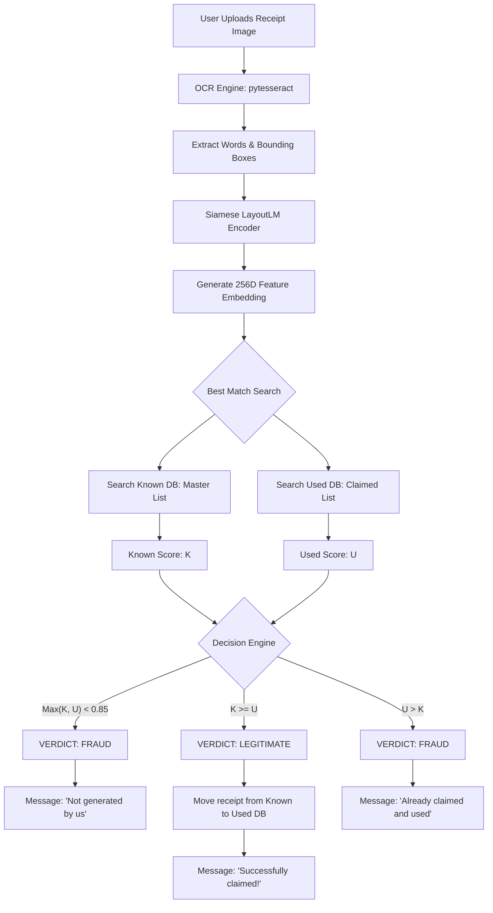

# Image Fraud Detection Workflow

This document describes the architectural flow of the standalone image-based fraud detection system.

## System Architecture

The system uses a Siamese LayoutLM architecture to compare receipts without needing explicit field extraction (like Total or Date). It relies on the spatial-textual layout "fingerprint".

### Process Flow

## Database Management

The system maintains two JSON databases in `artifacts/`:

1.  **known_receipts.json**: This is the "Seeded" database containing embeddings of valid receipts that have not yet been claimed.
2.  **used_receipts.json**: This is the "Claimed" database. Once a receipt is successfully uploaded, its entry is moved here to prevent reuse.

## decision Logic (The "Best Match" Rule)

Because many receipts share similar layouts (yielding 95%+ similarity scores), a simple "check used first" logic causes false positives. 

**Our solution**:
We calculate the similarity against *every* receipt in both databases. The system then compares the top score from the `Known` list against the top score from the `Used` list. 
*   If the image is a better match for a known (unclaimed) receipt, it is marked **LEGITIMATE**.
*   If it matches an already claimed receipt more closely, it is marked **FRAUD**.
